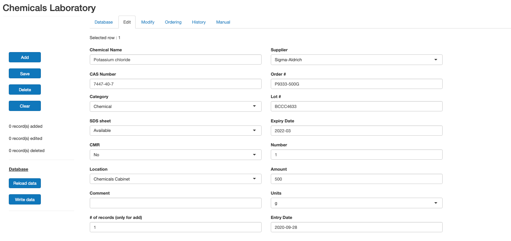

---

# Chemical DB

---

## <ins>Chemical Database Interface</ins>

In the place that I work the inventory of the chemicals we have is stored in an excel sheet. Maybe not the best idea, but well...  that's what's being used.

To make the management of the database a bit easier I wrote a shiny app which allows editing, adding, deleting etc via (more or less) database like interface. It's also important to know that I could not change the format of the original database, since it had to also remain accessible via excel.

I'm not planning to write a full guide to the app's inner workings, since it's pretty simple. My main goal was to get a bit more experience creating shiny apps, because I expect to be needing them for my own work. That is also the reason that's it's a bit 'messy' in terms of code layoout since I was learning along the way.

Below are a few pictures of the interface.

### Main view of the database

<!-- -->

### Main edit interface

<!-- -->

Note:
There are the usual comments to most functions/code in the app.R script. The database included <ins>chemicals-lab.xlsx</ins> contains only a few (fake) entries as obviously I cannot publish the database from the workplace. An important step with the original database was cleanup: getting rid of obvious spelling errors, replacing empty excel cells with empty strings (""), etc, etc. It helps the running of the shiny app more smoothly. Also important is that the app will create two extra excel sheets, namely "order" & "history". The first is meant to keep track of chemicals we once ordered, but may order again (anything that was ever put on the list is preserved based on order code & lot number). The "history" sheet is simpler: everytime an entry is deleted from the main excel sheet, it then gets added

---
